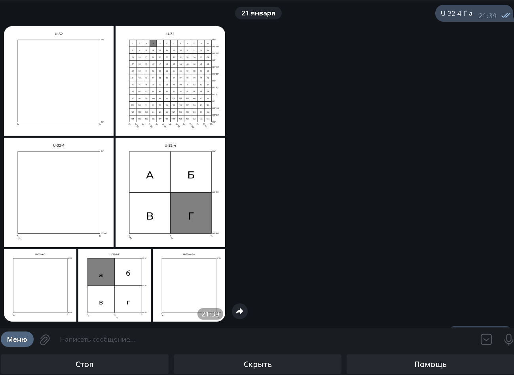

# Description

Телеграм-бот для создания графического представления номенклатуры топографической карты, используя или саму номенклатуру (например, `U-32-4-Г-а`), или координаты и необходимый масштаб.

Умеет работать с масштабами:

1. 1/1_000_000
2. 1/500_000
3. 1/300_000
4. 1/200_000
5. 1/100_000
6. 1/50_000
7. 1/25_000
8. 1/10_000
9. 1/5_000
10. 1/2_000

# Installation

```shell
git clone git@github.com:likeinlife/cartography_bot.git
```

# Launch

1. Создайте `.env` файл, ориентируясь на шаблон `sample.env`

## via Python

1. `poetry install` - установите все необходимые зависимости с помощью poetry
2. `poetry shell` - при необходимости, активируйте виртуальное окружение
3. `make run-python` - запустите проект.

## via Docker

1. `make run-docker` - запустить
2. `make down-docker` - остановить

# Env

- BOT_TOKEN - bot token
- ADMIN_ID - admin telegram id
- DEV_MODE (default=True) - бот отвечает только админу, включает dev-команды

# Testing

```shell
pytest tests
```

# Screenshot


